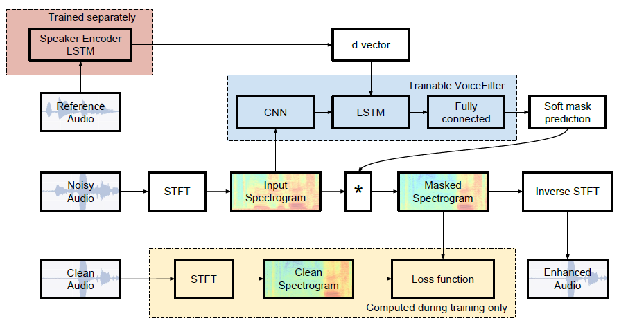
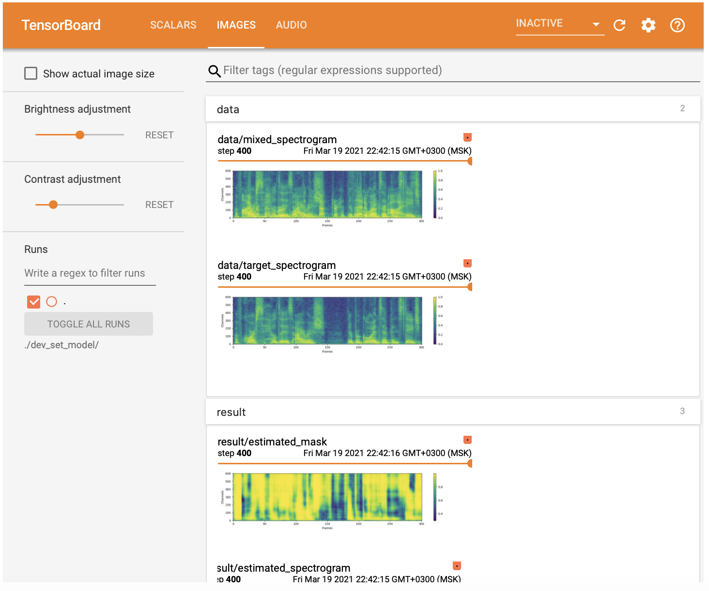
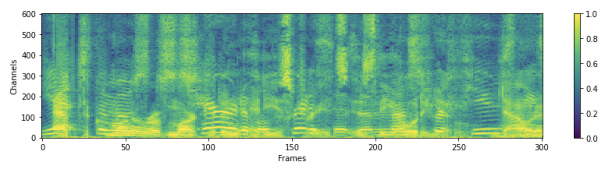
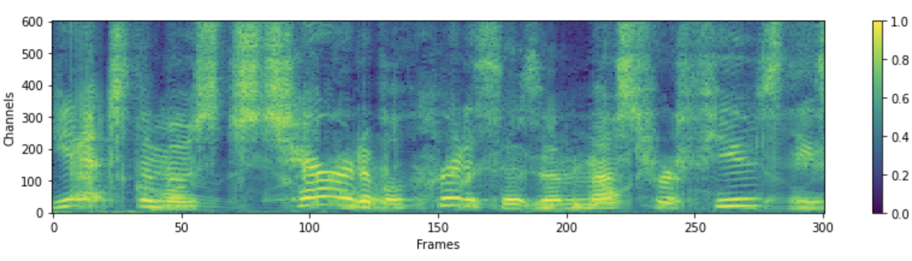
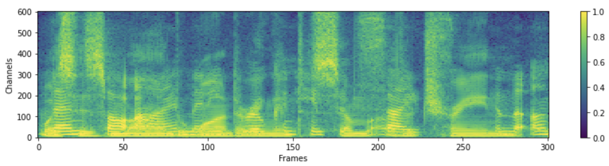
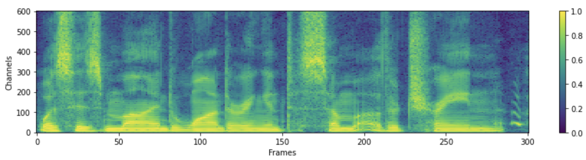
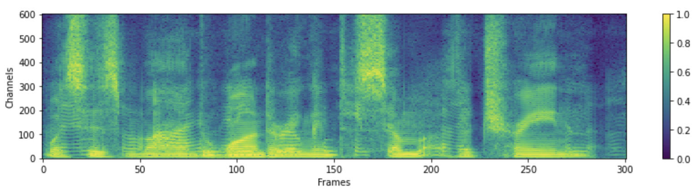

# Reverse VoiceFilter

This is the repository of the final project for the ML2021 course in Skoltech.
The authors are:

- Alsu Vakhitova (A.Vakhitova@skoltech.ru)
- Batyrkhan Gainitdinov (B.Gainitdinov@skoltech.ru)
- Mohammed Deifallah (M.Deifallah@skoltech.ru)
- Sergey Blintsov (S.Blintsov@skoltech.ru)
- Nikita Koritskiy (N.Koritskiy@skoltech.ru)

## Description

In this project we have set three goals for ourselves:

- Replicate the paper by Google AI's:
[VoiceFilter: Targeted Voice Separation by Speaker-Conditioned Spectrogram Masking](https://arxiv.org/abs/1810.04826).
- Analyze if filtered audio samples improve quality for other downstream tasks.
- Reverse the task described in the aforementioned paper.

The VoiceFilter system is designed to separate the voice of a target speaker from multi-speaker signals, by making use of a reference signal from the target speaker.
It consists of two networks: Speaker Encoder (produces speaker-discriminative embeddings) and VoiceFilter (spectrogram masking network that produces a mask).
The illustration of the system is below:



Reversing the task means that instead of removing all but one speaker's voice from an audio sample given his speech embedding,
the system will remove the speaker's voice except all other voices or sounds given his embedding.
We have come up with the following algorithms of reversing the task:

1. Keeping all the system as is, but reversing the effect of the soft mask at the inference stage.
2. Redesigning the dataset, leaving the noise as the target.

The easiest way to replicate our work would be to run the [reverse_voice_filter.ipynb](https://github.com/palette-knife25/reverse-voice-filter/blob/main/reverse_voice_filter.ipynb).

## Envionment Requirements

Our project was executed on Google Colab.
It is important to note that our experimental setup requires usage of **Tesla P100**,
because all other types of Colab GPUs yielded a "CUDNN_STATUS_EXECUTION_FAILED" error.

Check your GPU type using
    ```
    !nvidia-smi
    ``` command. If it does not comply to the requirements, repeat these steps until you get a Tesla P100:
    
1. Runtime > Factory Reset Runtime
2. ```!nvidia-smi```

## Dependencies

1. Python and packages

    This code was tested on Python 3.6 with PyTorch 1.0.1.
    Other packages can be installed by:

    ```bash
    pip install -r requirements.txt
    pip install ffmpeg-normalize
    ```

    Note:

    [ffmpeg-normalize](https://github.com/slhck/ffmpeg-normalize) is used for resampling and normalizing wav files.
    See README.md of [ffmpeg-normalize](https://github.com/slhck/ffmpeg-normalize/blob/master/README.md) for installation.

## Prepare Dataset

1. Download LibriSpeech dataset

    To replicate VoiceFilter paper, get LibriSpeech dataset at http://www.openslr.org/12/.
    `train-clean-100.tar.gz`(6.3G) contains speech of 252 speakers, and `train-clean-360.tar.gz`(23G) contains 922 speakers.
    You may use either, but the more speakers you have in dataset, the more better VoiceFilter will be.
    **In our project (because of limited computational resources) we have used `dev-clean.tar.gz`**.

1. Resample & Normalize wav files

    First, unzip `tar.gz` file to desired folder:
    ```bash
    tar -xvzf train-clear-360.tar.gz
    ```

    Next, copy `utils/normalize-resample.sh` to root directory of unzipped data folder. Then:
    ```bash
    vim normalize-resample.sh # set "N" as your CPU core number.
    chmod a+x normalize-resample.sh
    ./normalize-resample.sh # this may take long
    ```

1. Edit `config.yaml`

    ```bash
    cd config
    cp default.yaml config.yaml
    vim config.yaml
    ```

1. Preprocess wav files

    In order to boost training speed, perform STFT for each files before training by:
    ```bash
    python generator.py -c [config yaml] -d [data directory] -o [output directory] -p [processes to run] --reverse_data [False/True generate reverse data]
    ```


## Train VoiceFilter

1. Get pretrained model for speaker recognition system

    VoiceFilter utilizes speaker recognition system ([d-vector embeddings](https://google.github.io/speaker-id/publications/GE2E/)).
    Here, we provide pretrained model for obtaining d-vector embeddings.

    This model was trained with [VoxCeleb2](http://www.robots.ox.ac.uk/~vgg/data/voxceleb/vox2.html) dataset,
    where utterances are randomly fit to time length [70, 90] frames.
    Tests are done with window 80 / hop 40 and have shown equal error rate about 1%.
    Data used for test were selected from first 8 speakers of [VoxCeleb1](http://www.robots.ox.ac.uk/~vgg/data/voxceleb/vox1.html) test dataset, where 10 utterances per each speakers are randomly selected.
    
    **Update**: Evaluation on VoxCeleb1 selected pair showed 7.4% EER.
    
    The model can be downloaded at [this GDrive link](https://drive.google.com/file/d/1YFmhmUok-W76JkrfA0fzQt3c-ZsfiwfL/view?usp=sharing).

1. Run

    After specifying `train_dir`, `test_dir` at `config.yaml`, run:
    ```bash
    python trainer.py -c [config yaml] -e [path of embedder pt file] -m [name]
    ```
    This will create `chkpt/name` and `logs/name` at base directory(`-b` option, `.` in default)

1. View tensorboardX

    ```bash
    %load_ext tensorboard
    %tensorboard --logdir ./dev_set_model/
    ```
    
    

1. Resuming from checkpoint

    ```bash
    python trainer.py -c [config yaml] --checkpoint_path [chkpt/name/chkpt_{step}.pt] -e [path of embedder pt file] -m name
    ```

## Evaluate

```bash
python inference.py -c [config yaml] -e [path of embedder pt file] --checkpoint_path [path of chkpt pt file] -m [path of mixed wav file] -r [path of reference wav file] -o [output directory] --mask [how to apply mask: org/inv_div/inv_sub] --factor [float number required for inv_div/inv_sub masks]
```

## Results

### Replication

Spectrogram of a **mixed** audio:


Spectrogram of a **target clean** audio:


Spectrogram of a **result** audio:


### Reversing the effect of the soft mask at the inference stage

Spectrogram of a **mixed** audio:


Spectrogram of a **target clean** audio:


In the first case the noise was extracted by applying the soft mask in the following manner:

_result audio = mixed spectrogram * (1 - mask) / 0.7_, where 0.7 is a division factor that makes the resulting audio louder.

Spectrogram of a **result** audio (1st case):
:0.7-res-spec.png)

In the second case the noise was extracted by applying the soft mask in the following manner:

_result audio = 0.7 * mixed spectrogram / mask_, where 0.7 is a multiplication factor that makes the resulting audio quiter.

Spectrogram of a **result** audio (2nd case):
-res-spec.png)

### Redesigning the dataset, leaving the noise as the target.

In this case we have redesigned the dataset generation: now the noise is considered to be the target value,
instead of the speaker's voice.

Spectrogram of a **mixed** audio:


Spectrogram of a **target noise** audio:


Spectrogram of a **result** audio:


## Original Code

This repository is adapted from the original unofficial VoiceFilter PyTorch [Implementation](https://github.com/mindslab-ai/voicefilter/tree/master) by [Seungwon Park](http://swpark.me) at MINDsLab (yyyyy@snu.ac.kr, swpark@mindslab.ai)
